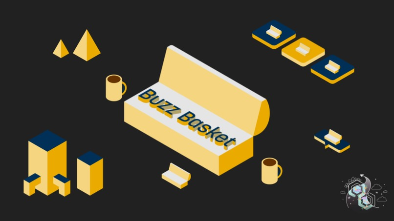
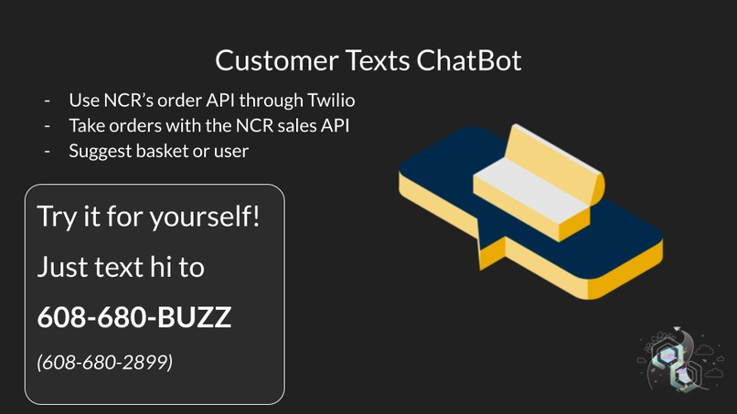

# BuzzBasket
HackGT 7 project

## Inspiration
America has a huge food waste problem. We waste 40% of our food each year with 80% of that being due to spoiled food. We wanted to try and help with this problem by preventing the food from spoiling in the first place. To do this, we created a bundling basket service called Buzzbasket!

## What it does
First you text the bot to get a personalized selection of available baskets. Think of each basket almost like a gift basket with many different items in it. For the demo version, we focused on local coffee roasteries so these baskets would have different kinds of coffee beans in them. Once you have received your personalized selection of baskets from our recommendation engine, you can choose which one to order. Then Buzzbasket will create an order for you in NCR Silver so that the information goes directly to the business and they can make your basket!

We also have a basket recommender for the small/local business to use. This system pulls in sales, inventory, and item information from NCR Silver in order to help the business decide what to put in the basket. It totals up the cost so they can easily see the profits it will generate as well as tries to use items that they have a large stock of that may be going to expire soon.

By using Buzzbasket, you're helping to support your local businesses during COVID-19 when they may not be getting as much business as usual.

## What's next for BuzzBasket
In the future we want to utilize the delivery partner API and coupon API to expand Buzzbasket to more stores and offer incentives for consumers to buy with us.

Further down the line we can help eliminate food waste by large food chains as well. Companies like Dunkin Donuts and more throw out large amounts of inventory daily. Using NCR’s delivery API, we would be able to allow customers to order otherwise wasted food for an extremely small sum without putting a large burden on those businesses.

# Project Setup
- `cd consumer && npm install`
- `source .env`
- `sudo setcap CAP_NET_BIND_SERVICE=+eip /usr/bin/node`
- `npm run dev`
